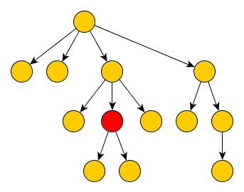
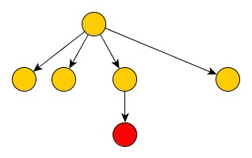
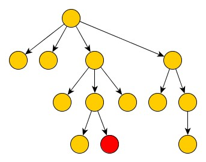
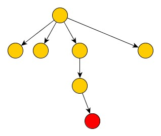

Bodybuilding.com coding-challenge
================

Thank you for taking the Bodybuilding.com Coding Challenge. We want to give you an opportunity to demonstrate your
 abilities. We will plan on using your deliverables as a point of conversation during a possible technical interview.
 Our hope is that this takes a few hours, not days. Have fun!

Create a REST API that returns website navigation data. The full navigation tree is included in [navigation.json](navigation.json).

Requirements:

* The API should load and parse navigation.json into memory once at application startup. It should **not** be reparsed for every request.
* Create a single root REST endpoint (mounted on: /)
* The endpoint will take a single path parameter which is an ID of a navigation node, if the ID parameter is missing assume it is "root"
* Using the ID the API will find the node and return JSON for a tree that has been pruned using the following rules:

    1. The root and it's children should *always* be included
    2. The path from the selected ID (node) to the root should be included
    3. The children of other nodes should *not* be included
* If the node cannot be found the endpoint should return 404

#### Pruning Examples

Given this initial tree:

The result when querying the red node should be:

Similarly for this node:

Resulting in:

#### Submission
* Fork this repo, commit your work, issue a pull request.
* Make sure you include a *README* that explains how to start your API. Feel free to mention any important decisions
about the project architecture that you think we should know.
* Include working unit tests